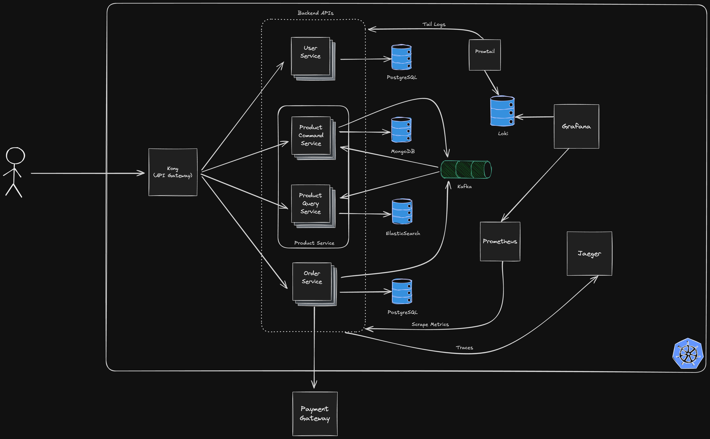

# Point of Sales Microservices

This is a work-in-progress side project, serving as an experimental playground to help me explore the intricacies of microservices. Please note that some implementations of certain concepts may not be 100% correct, as this is primarily a learning exercise.

## Contents
- [Architecure Overview](#architecture-overview)
- [Deployment](#deployment)
- [API Gateway](#api-gateway)
- [Services](#services)
- [Testing](#testing)
- [Observability](#observability)
- [Security](#security)

## Architecture Overview
The microservices in this project communicate via gRPC and message queues.

## Deployment
Currently, the microservices are deployed locally using Minikube.

## API Gateway
Kong (DB-less) is used as the API gateway for routing.

## Services
### User Service
This service manages user accounts and authentication. It’s built with Go and PostgreSQL.

### Product Service
This service handles product and inventory management, implemented with Go, MongoDB, Elasticsearch, and Kafka. It follows the CQRS (Command Query Responsibility Segregation) pattern.

### Order Service
This service is responsible for order management and payment processing, and is integrated with the Midtrans payment gateway (currently in sandbox mode). It’s built with Go, PostgreSQL, and Kafka, and communicates with the Product Service using gRPC calls.

## Testing
Test coverage for this project is currently very limited. At the moment, there are only a few integration tests, which use Testcontainers to spin up database containers.

## Observability
### Traces
All services use OpenTelemetry to generate traces, which are collected and visualized in Jaeger

## Security
### Mutual TLS (mTLS) with Istio
Inter-service communication is secured using Istio’s mTLS, and external requests are allowed only through the API gateway (Kong).